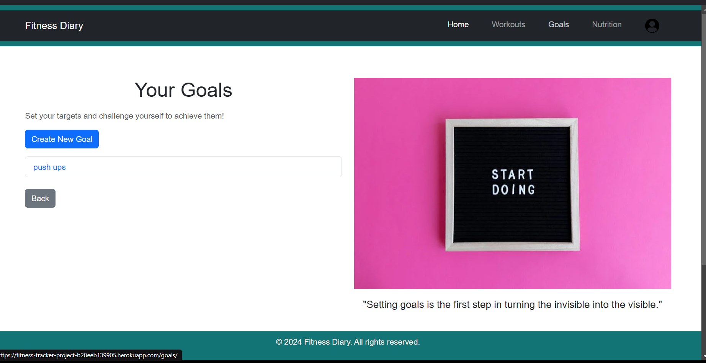
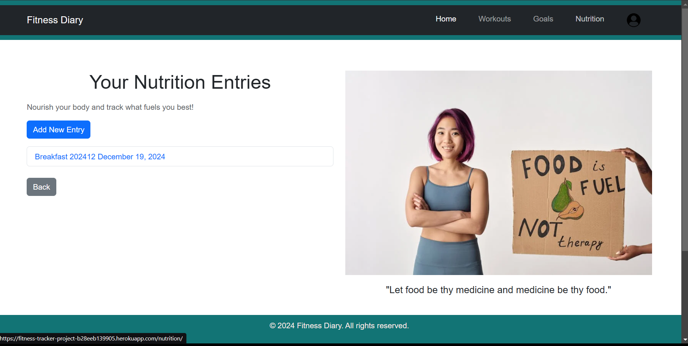

# Fitness Diary

Fitness Diary is a full-stack web application designed to help users record their fitness goals, log workouts, and track nutritional intake. Built with Django, HTML, CSS, and Bootstrap, this application showcases comprehensive CRUD (Create, Read, Update, Delete) operations within a user-friendly interface. 

## Table of Contents
- [Project Overview](#project-overview)
- [Features](#features)
- [Technology Stack](#technology-stack)
- [Agile Methodology](#agile-methodology)
- [Installation](#installation)
- [Usage](#usage)
- [Testing](#testing)
- [Deployment](#deployment)
- [Data Schema](#data-schema)
- [Security](#security)
- [UX Design Documentation](#ux-design-documentation)
- [Performance Optimization](#performance-optimization)
- [Future Enhancements](#future-enhancements)
- [Credits](#credits)
- [Contact](#contact)
- [Links](#links)

[Back to Contents](#table-of-contents)

## Project Overview
Fitness Diary aims to provide users with a centralized platform to record and achieve their fitness objectives. Whether it's increasing daily steps, logging workouts, or managing nutritional intake, Fitness Diary is a way to digitally record your fitness journey so you can see improvement and encourage yourself to continue.

[Back to Contents](#table-of-contents)

## Features
- **User Registration & Authentication:**
    - Secure user sign-up and login functionalities using django-allauth
    - Profile management

- **Goals Setting:**
    - Create, view, update, and delete fitness goals
    - Track progress towards each goal

- **Workouts Logging:**
    - Log details of workouts, including type, duration, and calories burned
    - View and manage workout history

- **Nutrition Logging:**
    - Track daily nutritional intake, including calories and macronutrients
    - Manage meal logs and dietary plans

- **Responsive Design:**
    - Mobile-friendly interface using Bootstrap
    - Accessible design adhering to UX principles

- **Real-Time Feedback:**
    - Immediate reflections of CRUD operations in the user interface

[Back to Contents](#table-of-contents)

## Technology Stack
- **Backend:**
    - Python 
    - Django
    - django-allauth (Authentication)
- **Front-end:**
    - HTML5
    - CSS3
    - Bootstrap 5
    - JavaScript (ES6)
- **Database:**
    - SQLite
- **Others:**
    - WhiteNoise (Static Files Management)
    - CORS Headers
    - Crispy Forms
    - Debug Toolbar

[Back to Contents](#table-of-contents)

## Agile Methodology
Fitness Diary was developed using the Agile methodology, ensuring iterative progress and adaptability throughout the project lifecycle.

### User Stories

#### Epic 1: User Management
- As a user, I want to register and log in so that I can securely access my fitness data
- As a user, I want to update my profile information to keep my account details current

#### Epic 2: Goals Management
- As a user, I want to create fitness goals so that I have targets to achieve
- As a user, I want to view my goals to track my progress
- As a user, I want to update or delete my goals as my objectives change

#### Epic 3: Workouts Logging
- As a user, I want to log my workouts to monitor my exercise routines
- As a user, I want to view my workout history to analyze my performance over time
- As a user, I want to update or delete my workouts as my objectives change

#### Epic 4: Nutrition Logging
- As a user, I want to log my meals to track my nutritional intake
- As a user, I want to view my nutrition history to manage my diet effectively
- As a user, I want to update or delete my nutrition logs as my objectives change

[Back to Contents](#table-of-contents)

## Installation

### Prerequisites
- Python 3.8+
- pip
- Git

### Steps
1. Clone the Repository:
    ```bash
    git clone https://github.com/pac-dan/fitness-check.git
    cd Fitness_Diary
    ```

2. Create Virtual Environment:
    ```bash
    python -m venv env
    source env\Scripts\activate
    ```

3. Install Dependencies:
    ```bash
    pip install -r requirements.txt
    ```

4. Apply Migrations:
    ```bash
    python manage.py migrate
    ```

5. Create a Superuser:
    ```bash
    python manage.py createsuperuser
    ```

6. Run the Development Server:
    ```bash
    python manage.py runserver
    ```

7. Access the Application:
    - Open http://localhost:8000 in your browser

[Back to Contents](#table-of-contents)

## Usage

### User Registration & Authentication
- Sign Up: Navigate to the registration page to create a new account
- Log In: Access your account using your credentials
- Profile Management: Update your profile information as needed

### Goals Management
- Create Goal: Set new fitness goals with specific targets
- View Goals: Monitor your current and past goals
- Update/Delete Goal: Modify or remove goals as your objectives evolve

### Workouts Logging
- Log Workout: Record details of your workouts, including type, duration, and calories burned
- View Workouts: Review your workout history to track progress

### Nutrition Logging
- Log Meal: Enter details about your meals, including calories and macronutrients
- View Nutrition History: Analyze your dietary intake over time

[Back to Contents](#table-of-contents)

## Testing
Ensuring the reliability and robustness of Fitness Diary through comprehensive testing.

### Manual Testing

| **Feature** | **Test Case** | **Expected Result** | **Actual Result** | **Status** |
|------------|--------------|-------------------|------------------|------------|
| **User Authentication** |
| Registration | Create new user account | Account created successfully | Account created successfully | ✅ |
| Login | Log in with valid credentials | Successful login | Successful login | ✅ |
| Login | Log in with invalid credentials | Error message displayed | Error message displayed | ✅ |
| Logout | Click logout button | User logged out successfully | User logged out successfully | ✅ |
| **Goals Management** |
| Create Goal | Add new fitness goal | Goal created and displayed | Goal created and displayed | ✅ |
| View Goals | Access goals page | All goals displayed | All goals displayed | ✅ |
| Update Goal | Modify existing goal | Changes saved successfully | Changes saved successfully | ✅ |
| Delete Goal | Remove a goal | Goal deleted from list | Goal deleted from list | ✅ |
| **Workouts Logging** |
| Log Workout | Add new workout | Workout logged successfully | Workout logged successfully | ✅ |
| View Workouts | Access workouts page | All workouts displayed | All workouts displayed | ✅ |
| Update Workout | Modify workout details | Changes saved successfully | Changes saved successfully | ✅ |
| Delete Workout | Remove a workout | Workout deleted from list | Workout deleted from list | ✅ |
| **Nutrition Logging** |
| Log Meal | Add new meal entry | Meal logged successfully | Meal logged successfully | ✅ |
| View Nutrition | Access nutrition page | All meals displayed | All meals displayed | ✅ |
| Update Meal | Modify meal details | Changes saved successfully | Changes saved successfully | ✅ |
| Delete Meal | Remove a meal entry | Meal deleted from list | Meal deleted from list | ✅ |
| **Responsive Design** |
| Mobile View | View on mobile device | Layout adjusts correctly | Layout adjusts correctly | ✅ |
| Tablet View | View on tablet | Layout adjusts correctly | Layout adjusts correctly | ✅ |
| Desktop View | View on desktop | Layout displays correctly | Layout displays correctly | ✅ |
| **Accessibility** |
| Keyboard Navigation | Navigate using keyboard | All elements accessible | All elements accessible | ✅ |
| Screen Reader | Test with screen reader | Content read correctly | Content read correctly | ✅ |
| Color Contrast | Check color contrast | Meets WCAG standards | Meets WCAG standards | ✅ |
| **Error Handling** |
| Invalid Input | Submit invalid data | Appropriate error message | Appropriate error message | ✅ |
| 404 Page | Access non-existent page | Custom 404 page displayed | Custom 404 page displayed | ✅ |
| 500 Error | Trigger server error | Custom 500 page displayed | Custom 500 page displayed | ✅ |

### Testing Tools Used
- **WAVE:** For accessibility testing
- **Lighthouse:** For performance and accessibility metrics
- **Browser DevTools:** For responsive design testing
- **Manual Testing:** For user flows and functionality

[Back to Contents](#table-of-contents)

## Deployment
Fitness Diary is deployed on Heroku, ensuring accessibility from anywhere. This section details the deployment process and configuration specific to this project.

### Prerequisites
- A Heroku account
- Git installed locally
- Heroku CLI installed
- All project dependencies listed in requirements.txt
- A Procfile for Heroku
- A runtime.txt file specifying Python version

### Project Configuration Files

#### requirements.txt
The requirements.txt file includes all necessary Python packages for the project:
```
asgiref==3.8.1
colorama==0.4.6
dj-database-url==2.3.0
dj-rest-auth==7.0.0
Django==5.1.3
django-allauth==65.2.0
django-cors-headers==4.6.0
django-crispy-forms==2.3
django-debug-toolbar==4.4.6
django-environ==0.11.2
django-extensions==3.2.3
django-filter==24.3
djangorestframework==3.15.2
flake8==7.1.1
gunicorn==23.0.0
iniconfig==2.0.0
mccabe==0.7.0
packaging==24.2
pillow==11.0.0
pluggy==1.5.0
psycopg2-binary==2.9.10
pycodestyle==2.12.1
pyflakes==3.2.0
pytest==8.3.3
sqlparse==0.5.2
typing_extensions==4.12.2
tzdata==2024.2
whitenoise==6.8.2
```

#### Procfile
The Procfile tells Heroku how to run the application:
```
web: gunicorn fitness_tracker.wsgi --log-file -
```

#### runtime.txt
Specifies the Python version for Heroku:
```
python-3.11.6
```

### Heroku Setup

1. **Create Heroku App**
   ```bash
   heroku create fitness-diary-app
   ```

2. **Set Environment Variables**
   ```bash
   heroku config:set \
     SECRET_KEY='your-secret-key' \
     DEBUG='False' \
     ALLOWED_HOSTS='fitness-tracker-project-b28eeb139905.herokuapp.com/' \
     DATABASE_URL='your-database-url' \
     CLOUDINARY_URL='your-cloudinary-url' \
     EMAIL_HOST_USER='your-email' \
     EMAIL_HOST_PASSWORD='your-email-password'
   ```

3. **Configure Static Files**
   - Ensure STATIC_ROOT is set in settings.py
   - Configure WhiteNoise for static file serving
   - Add necessary middleware in settings.py

4. **Database Configuration**
   - Heroku automatically provides a PostgreSQL database
   - Update DATABASES setting in settings.py to use dj_database_url

5. **Deployment Steps**
   ```bash
   # Initialize Git repository (if not already done)
   git init
   
   # Add and commit all files
   git add .
   git commit -m "Initial commit"
   
   # Add Heroku remote
   heroku git:remote -a fitness-tracker-app
   
   # Push to Heroku
   git push heroku main
   
   # Run migrations
   heroku run python manage.py migrate
   
   # Create superuser
   heroku run python manage.py createsuperuser
   
   # Collect static files
   heroku run python manage.py collectstatic --noinput
   ```

### Post-Deployment Checklist
- [ ] Verify the application is running at https://fitness-tracker-project-b28eeb139905.herokuapp.com/
- [ ] Test all user flows (registration, login, CRUD operations)
- [ ] Verify static files are serving correctly
- [ ] Check email functionality (if implemented)
- [ ] Test database operations
- [ ] Verify security settings (HTTPS, secure cookies)
- [ ] Monitor application logs for any errors

### Troubleshooting
- **Static Files Not Loading:**
  - Verify WhiteNoise configuration
  - Check STATIC_ROOT setting
  - Ensure collectstatic completed successfully

- **Database Issues:**
  - Check DATABASE_URL configuration
  - Verify migrations are up to date
  - Monitor Heroku logs for database errors

- **Application Errors:**
  - Check Heroku logs: `heroku logs --tail`
  - Verify all environment variables are set correctly
  - Ensure DEBUG=False in production

### Security Considerations
- All sensitive information is stored in Heroku config vars
- DEBUG is set to False in production
- SECURE_SSL_REDIRECT is enabled
- SESSION_COOKIE_SECURE and CSRF_COOKIE_SECURE are set to True
- X_FRAME_OPTIONS is set to 'DENY'
- SECURE_BROWSER_XSS_FILTER is enabled

[Back to Contents](#table-of-contents)

## Data Schema

### Goals Model
| Field | Type | Description |
|-------|------|-------------|
| user | ForeignKey | Links to the CustomUser model |
| title | CharField | Title of the fitness goal |
| description | TextField | Detailed description (optional) |
| target | PositiveIntegerField | Target value (e.g., steps, calories) |
| created_at | DateTimeField | Timestamp when the goal was created |
| updated_at | DateTimeField | Timestamp when the goal was last updated |

### Workouts Model
| Field | Type | Description |
|-------|------|-------------|
| user | ForeignKey | Links to the CustomUser model |
| workout_type | CharField | Type of workout (e.g., Running, Cycling) |
| duration | PositiveIntegerField | Duration of the workout in minutes |
| calories_burned | PositiveIntegerField | Estimated calories burned during the workout |
| date | DateField | Date of the workout |
| created_at | DateTimeField | Timestamp when the workout was logged |
| updated_at | DateTimeField | Timestamp when the workout was last updated |

### Nutrition Logs Model
| Field | Type | Description |
|-------|------|-------------|
| user | ForeignKey | Links to the CustomUser model |
| meal_type | CharField | Type of meal (e.g., Breakfast, Lunch) |
| calories | PositiveIntegerField | Total calories consumed in the meal |
| carbohydrates | PositiveIntegerField | Carbohydrate intake in grams |
| proteins | PositiveIntegerField | Protein intake in grams |
| fats | PositiveIntegerField | Fat intake in grams |
| date | DateField | Date of the meal |
| created_at | DateTimeField | Timestamp when the meal was logged |
| updated_at | DateTimeField | Timestamp when the meal was last updated |

[Back to Contents](#table-of-contents)

## Security
- **Environment Variables:** All sensitive information, including SECRET_KEY and database credentials, are stored in environment variables and not committed to the repository
- **Authentication:** Utilizes django-allauth for robust user authentication and management
- **Authorization:** Role-based access control ensures that users can only access and manipulate their own data
- **Secure Settings:**
    - SECURE_SSL_REDIRECT is enabled to enforce HTTPS
    - SESSION_COOKIE_SECURE and CSRF_COOKIE_SECURE are set to True to ensure cookies are only sent over HTTPS
- **Input Validation:** All forms include validation to prevent malicious inputs
- **Error Handling:** Graceful error handling ensures that users are informed of issues without exposing sensitive information

[Back to Contents](#table-of-contents)

## UX Design Documentation

### Design Process
The design of Fitness Diary focused on creating a user-friendly and accessible interface without formal wireframes. Key considerations included:

- **User-Centric Layout:** Organized the application into intuitive sections: Dashboard, Goals, Workouts, Nutrition, and Profile
- **Consistent Navigation:** Implemented a consistent header and sidebar for easy navigation across different sections
- **Responsive Design:** Utilized Bootstrap 5 to ensure the application is fully responsive on all devices
- **Accessibility:** Followed WCAG guidelines to make the application accessible to users with disabilities

### Design Decisions
- **Clean and Minimalistic Design:** Chose a minimalistic approach to reduce clutter and help users focus on their fitness tracking
- **Real-Time Feedback:** Ensured that CRUD operations provide immediate feedback to enhance user experience
- **Mobile-First Approach:** Prioritized mobile responsiveness to cater to users who prefer accessing the application on-the-go

### Color Scheme and Typography

#### Color Palette
The application uses a carefully selected color palette to create a clean, professional, and motivating interface:

- **Primary Color:** #127475 (Teal) - Used for header, footer, and main navigation elements
- **Secondary Color:** #007BFF (Blue) - Used for buttons and interactive elements
- **Accent Color:** #0056b3 (Dark Blue) - Used for button hover states
- **Background Colors:**
  - Main: #FFEBE7 (Light Pink) - Body background
  - Content: #FFFFFF (White) - Main content area background
- **Text Colors:**
  - Primary: #000000 (Black) - Main text
  - Secondary: #FFFFFF (White) - Text on dark backgrounds
  - Light: #FFEBE7 (Light Pink) - Text on header/footer

#### Typography
The application uses a modern, clean typography system for optimal readability:

- **Primary Font:** 'Roboto' - Used for headings and body text
  - Light, Regular, Medium, and Bold weights
  - Excellent readability on all screen sizes
  - Modern, clean aesthetic that matches the application's design language

- **Font Sizes:**
  - Headings:
    - H1: 2.5rem (40px)
    - H2: 2rem (32px)
    - H3: 1.75rem (28px)
    - H4: 1.5rem (24px)
  - Body Text: 1rem (16px)
  - Small Text: 0.875rem (14px)

- **Line Heights:**
  - Headings: 1.2
  - Body Text: 1.5
  - Small Text: 1.4

- **Font Weights:**
  - Regular: 400
  - Medium: 500
  - Bold: 700

The typography system is designed to create a clear visual hierarchy while maintaining excellent readability across all devices and screen sizes.

### Visual Representations

#### Wireframes
The following wireframes illustrate the initial design concepts for the application:

- **Goals Page Wireframe**
  
  *Annotation: Initial wireframe design for the goals management page*

- **Workouts Page Wireframe**
  
  *Annotation: Initial wireframe design for the workouts logging page*

- **Nutrition Page Wireframe**
  
  *Annotation: Initial wireframe design for the nutrition tracking page*

- **User Profile Wireframe**
  
  *Annotation: Initial wireframe design for the user profile page*

- **Home Page Wireframe**
  
  *Annotation: Initial wireframe design for the home/dashboard page*

#### Final Implementation Screenshots

- **Home Page**
  
  *Annotation: The home page features a dashboard overview with quick access to goals, workouts, and nutrition sections*

- **Goals Page**
  
  *Annotation: Users can create, view, update, and delete their fitness goals. Progress is tracked with visual indicators*

- **Workout Page**
  
  *Annotation: The workout logging interface allows users to input workout details and view their workout history*

- **Nutrition Page**
  
  *Annotation: Users can log their meals, track caloric intake, and manage dietary plans*

- **User Profile Page**
  
  *Annotation: Profile management section where users can update their personal information and preferences*

[Back to Contents](#table-of-contents)

## Performance Optimization
- **Database Indexing:** Indexed frequently queried fields to speed up data retrieval
- **Caching:** Implemented caching strategies using Django's cache framework and WhiteNoise for static assets
- **Minification:** Minified CSS and JavaScript files to reduce load times
- **Lazy Loading:** Images and resources are loaded lazily to improve initial page load performance

[Back to Contents](#table-of-contents)

## Future Enhancements
- **Data Analysis:** Implement data visualization tools to analyze user data and track progress
- **Visual Charts:** Integrate charts to represent the progress of goals, workouts, and nutrition
- **Notifications:** Add notifications to alert users when they complete a task or reach a milestone
- **Mobile Application:** Develop a mobile version of Fitness Diary for on-the-go access
- **Integration with Wearables:** Connect Fitness Diary with wearable devices to automatically log fitness data

[Back to Contents](#table-of-contents)

## Credits
### Code and Development
- [Django Documentation](https://docs.djangoproject.com/) - For comprehensive Django framework documentation
- [Bootstrap Documentation](https://getbootstrap.com/docs/5.0/getting-started/introduction/) - For UI components and responsive design
- [Django Allauth Documentation](https://django-allauth.readthedocs.io/en/latest/) - For authentication implementation

### Tools and Services
- [Heroku](https://www.heroku.com/) - For application deployment
- [GitHub](https://github.com/) - For version control and project management
- [WAVE](https://wave.webaim.org/) - For accessibility testing
- [Lighthouse](https://developers.google.com/web/tools/lighthouse) - For performance and accessibility metrics

### Inspiration
- [Code Institute](https://codeinstitute.net/) - For project structure and development guidance

[Back to Contents](#table-of-contents)

## Contact
For any inquiries or feedback, please contact djjohnston98@hotmail.com

[Back to Contents](#table-of-contents)

## Links
- [Live Application](https://fitness-tracker-project-b28eeb139905.herokuapp.com/)
- [GitHub Projects](https://github.com/users/pac-dan/projects/1)
